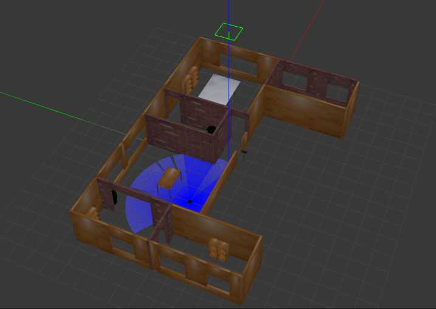
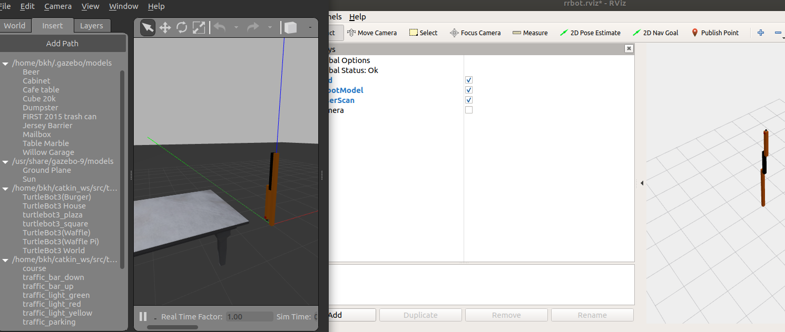

[wiki로 돌아가기](https://github.com/bkh751/servebot/wiki/%EB%AA%85%EB%A0%B9%EC%96%B4%EB%AA%A9%EB%A1%9D)


## 시뮬레이션 

__환경변수 설정 하기__
  
    vim ~/.bashrc
    
    # 아래명령어를 쳐넣기
    export GAZEBO_MODEL_PATH=$(rospack find servebot)/models:$GAZEBO_MODEL_PATH
    export TURTLEBOT3_MODEL=waffle

```bash
# house map 을 시작하기 
roslaunch servebot house.launch
```


```bash
# 실제 로봇 Simulation -  Gazebo 
roslaunch servebot rrbot_world.launch

# Rviz 로 topic 현황 확인하기 
roslaunch servebot rrbot_rviz.launch   
```


```bash
제작한 맵 기반 localization & path planning & 움직임 제어 
roslaunch servebot gazebo_change_world.launch 
```
>TODO - 위 커멘드에 대한 사진 첨부
