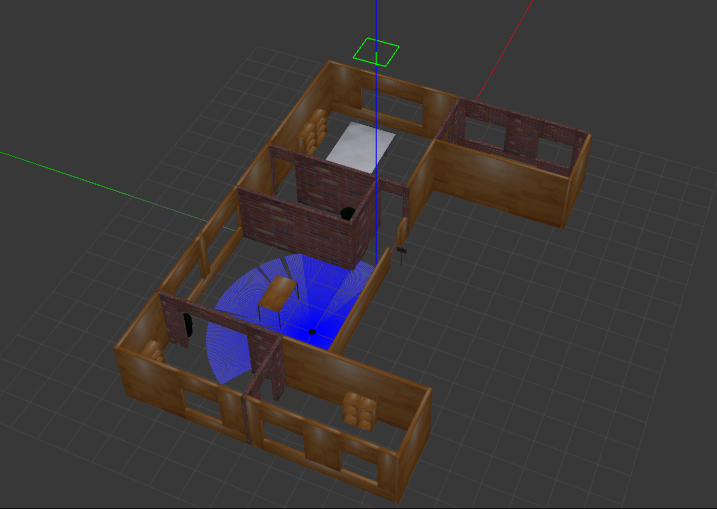
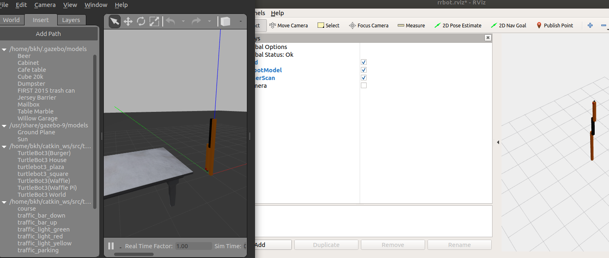

# Serving robot

2019 9월 시작된 서빙로봇 프로젝트 

남창호 황지윤 백경호 

8월 - 하드웨어 주문 및 기획, 계획

9월 - 시뮬레이션을 활용한 서빙 시나리오 테스트

10월 - ROS 를 활용한 실제 로봇 주행 및 서빙루틴 실행 및 테스트 


## 참고한 오픈 소스

https://github.com/minht57/ROS_Basic_SLAM


## 시뮬레이션 코드 
```bash
# house map 을 시작하기 
roslaunch servebot house.launch
```


```bash
# 실제 로봇 Simulation -  Gazebo 
roslaunch servebot rrbot_world.launch

# Rviz 로 topic 현황 확인하기 
roslaunch servebot rrbot_rviz.launch   
```


```bash
제작한 맵 기반 localization & path planning & 움직임 제어 
roslaunch servebot gazebo_change_world.launch 
```
>TODO - 위 커멘드에 대한 사진 첨부


## USB Camera 연결하여 Streaming 확인하기
```bash
#usb 연결 확인
lsusb

# 시스템 카메라 인식 확인
ls /dev | grep video*

# ros kinetic usb cam 패키지 설치
sudo apt install ros-kinetic-usb-cam
sudo apt-get install ros-kinetic-camera-info-manager
cd ~/catkin_ws && catkin_make

#  usb-cam node test launch file, usb 카메라 스트리밍 확인
# video device를 /dev/video1로 변경
vi /opt/ros/kinetic/share/usb_cam/launch/usb_cam-test.launch

# Streaming test 실행
roslaunch usb_cam usb_cam-test.launch
```

## USB Camera로 YOLOv3 Inference 실행
```bash
# darknet_ros 설치
cd ~/catkin_ws/src/
git clone https://github.com/leggedrobotics/darknet_ros.git

# yolov3-tiny.weights 다운로드
# 참조 : https://pjreddie.com/darknet/yolo/
cd ~/catkin_ws/src/servebot/darknet_ros/darknet_ros/yolo_network_config/weights
wget https://pjreddie.com/media/files/yolov3-tiny.weights

# yolov3-tiny.cfg 다운로드
cd ~/catkin_ws/src/servebot/darknet_ros/darknet_ros/yolo_network_config/cfg
wget https://raw.githubusercontent.com/pjreddie/darknet/master/cfg/yolov3-tiny.cfg

# yolov3-tiny.yaml 파일 생성 및 수정
cd ~/catkin_ws/src/darknet_ros/darknet_ros/config
cp yolov3.yaml yolov3-tiny.yaml

gedit yolov3_tiny.yaml 
# 아래와 같이 수정
config_file의 name을 yolov3-tiny.cfg
weight_file의 name을 yolov3-tiny.weights

# ros.yaml에서 수신할 camera topic 명 변경
gedit ~/catkin_ws/src/darknet_ros/darknet_ros/config/ros.yaml
> camera_reading의 topic을 `/camera/image_raw`로 변경

# darknet Makefile 수정
gedit ~/catkin_ws/src/darknet_ros/darknet
```

  

```bash
cd ~/catkin_make && catkin_make

# 테스트
roslaunch servebot yolo_v3_tiny.launch
```bash
# 현재 Robot Camera streaming record하기
# script 실행시킨 디렉토리 위치에 'output.avi'로 저장 됨
rosrun servebot CamRecord.py
```
